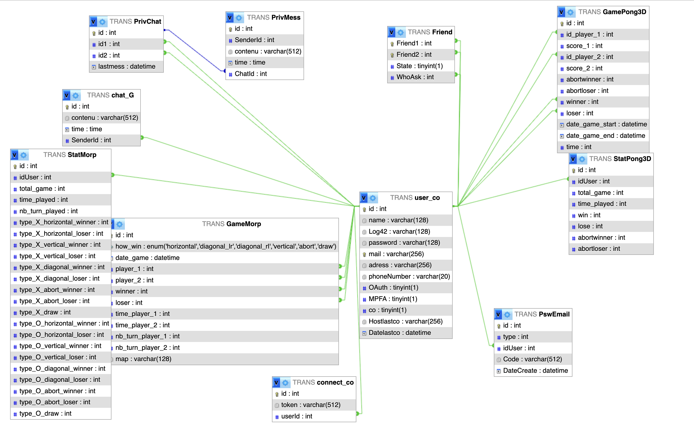

*This project has been created as part of the 42 curriculum by Fcretin, Tvoisin, Niroched, Sflechel, Edarnand.*

<!-- Ceci sont des commentaire pour avec ma font: Double-struck et des icon personnaliser -->
<!-- 📘 🗎 🖋 👀 🗣 … 🧪-->
<!-- 𝔸 𝔹 ℂ 𝔻 𝔼 𝔽 𝔾 ℍ 𝔾 𝕀 𝕁 𝕂 𝕃 𝕄 ℕ 𝕆 ℙ ℚ ℝ 𝕊 𝕋 𝕌 𝕍 𝕎 𝕏 𝕐 ℤ -->
<!-- 𝕒 𝕓 𝕔 𝕕 𝕖 𝕗 𝕘 𝕙 𝕚 𝕛 𝕜 𝕝 𝕞 𝕟 𝕠 𝕡 𝕢 𝕣 𝕤 𝕥 𝕦 𝕧 𝕨 𝕩 𝕪 𝕫  -->
<!-- 𝟘 𝟙 𝟚 𝟛 𝟜 𝟝 𝟞 𝟟 𝟠 𝟡 -->
<!-- 𝔸𝔹ℂ𝔻𝔼𝔽𝔾ℍ𝕀𝕁𝕂𝕃𝕄ℕ𝕆ℙℚℝ𝕊𝕋𝕌𝕍𝕎𝕏𝕐ℤ𝕒𝕓𝕔𝕕𝕖𝕗𝕘𝕙𝕚𝕛𝕜𝕝𝕞𝕟𝕠𝕡𝕢𝕣𝕤𝕥𝕦𝕧𝕨𝕩𝕪𝕫𝟘𝟙𝟚𝟛𝟜𝟝𝟞𝟟𝟠𝟡 -->
<!-- http://github.com/tandpfun/skill-icons#readme -->
<!-- [tag_test]: url "on hover" -->
<!-- Ceci sont des commentaire pour avec ma font: Double-struck et des icon personnaliser -->

[tag_icon_front]: https://skillicons.dev/icons?i=react,sass
[tag_icon_back]: https://skillicons.dev/icons?i=express,js
[tag_icon_db]: https://skillicons.dev/icons?i=mysql
[tag_icon_infrastructure]: https://skillicons.dev/icons?i=docker,nginx
[tag_icon_all]: https://skillicons.dev/icons?i=github,npm,nodejs,docker,nginx,express,mysql,react,js,html,sass,ts,makefile
[tag_ressource_grid]: https://cssgrid-generator.netlify.app/

# 𝔽t_transcendence too late (without `_` yes....)
<p align="center">
  <a href="https://skillicons.dev">
    
    <!-- ![icons][tag_icon_all] -->
  </a>
</p>

<details id="summary">
    <summary>
        <h2>🗓 𝕊ummary</h2>
    </summary>

- [𝔻escription](#description)
- [👥 𝕋eam 𝕀nformation](#team_info)
- [📋 ℙroject 𝕄anagement](#project_management)
- [🛠 𝕀nstructions & ℝequirements](#requirements)
- [🏗 𝕋echnical 𝕊tack](#tech_stack)
- [🗄 𝔻atabase 𝕊chema](#db_schema)
- [🎮 𝔽eatures 𝕃ist](#features)
- [📦 𝕄odules](#modules)
- [🙋 𝕀ndividual ℂontributions](#contributions)
- [ℝesources](#resources)
- [📁 ℝepository 𝕊tructure 𝕋ree](#rst)

</details>

<br>

---

<br>

<details id="description">
    <summary>
        <h2>𝔻escription</h2>
    </summary>

## ft_transcendence — Real-Time Multiplayer Gaming Platform

ft_transcendence is a full-stack web application that lets users compete against each other online in real time. The platform features two distinct games — a **3D Pong** game and a **Tic-Tac-Toe (Morpion)** — alongside a full user management system, real-time chat, authentication, and a matchmaking system.

### Key Features

- 🏓 **Pong 3D** — A three-dimensional take on the classic Pong game, powered by Colyseus for authoritative server-side game state and real-time synchronization.
- ✖️ **Morpion (Tic-Tac-Toe)** — A fully custom matchmaking and room system built from scratch with WebSockets, supporting remote player matchmaking.
- 💬 **Real-Time Chat** — In-app messaging between users.
- 🔐 **Secure Authentication** — User login, registration, and session management.
- 👤 **User Profiles** — Customizable profiles with stats and match history.

- [🗓 𝕊ummary](#summary)

</details>

<br>

---

<br>

<details id="team_info">
    <summary>
        <h2>👥 𝕋eam 𝕀nformation</h2>
    </summary>

| Login     | Role            | Responsibilities                                                              |
| :---      | :---            | :---                                                                          |
| Fcretin   | Product Owner   | Product vision, prioritization                                                |
| Tvoisin   | Project Manager | Team coordination, task tracking & deadline management                        |
| Edarnand  | Technical Lead  | Architecture design, code quality, code reviews, code refactor                |
| Niroched  | Developer       | Morpion game logic, custom room & matchmaking system (WebSockets)             |
| Sflechel  | Developer       | Pong 3D game logic, Colyseus server integration & TypeScript game server      |

- [🗓 𝕊ummary](#summary)

</details>

<br>

---

<br>

<details id="project_management">
    <summary>
        <h2>📋 ℙroject 𝕄anagement</h2>
    </summary>

### Work Organization

Weekly planning sessions with a short retrospective to identify blockers and improvements.


### Tools Used

| Purpose              | Tool                              |
| :---                 | :---                              |
| Version control      | Git & GitHub                      |
| Communication        | Discord                           |

### Meetings & Communication

- Weekly sprint planning meetings.
- All major technical decisions were discussed orally and in Discord before implementation.

- [🗓 𝕊ummary](#summary)

</details>

<br>

---

<br>

<details id="requirements">
    <summary>
        <h2>🛠 𝕀nstructions & ℝequirements</h2>
    </summary>

### Prerequisites

| Tool           | Version / Notes                        |
| :---           | :---                                   |
| Git            | Any standard version                   |
| Make           | Any standard version                   |
| Docker Compose | >= 2.x (included with Docker Desktop)  |
| Docker         | >= 24.x                                |

> No local Node.js, MySQL, or Nginx installation required — everything runs inside Docker containers.

### Setup & Installation

1. **Clone the repository:**
   ```bash
   git clone <repository-url>
   cd ft_transcendence
   ```

2. **Create your environment file:**
   ```bash
   cp env.exemple .env
   ```
      <!-- cp /sgoinfre/fcretin/private/ft_transcendence_too_late/.env .env -->
   Then open `.env` and fill in the required values (database credentials, JWT secrets, OAuth keys if applicable, etc.).

3. **Run in production mode:**
   ```bash
   make prod
   ```

   Or in development mode with hot reload:
   ```bash
   make dev
   ```

### Useful Makefile Commands

| Command       | Description                              |
| :---          | :---                                     |
| `make prod`   | Build and start all containers (prod)    |
| `make dev`    | Start with hot reload (dev mode)         |
| `make down`   | Stop and remove containers               |
| `make clean`  | Remove containers, volumes, and images   |
| `make logs`   | Follow container logs                    |

### Access

#### Once running,
- Prod open your browser at: `https://localhost:9443`
- Dev open your browser at: `http://localhost:5173` (`http://localhost:8081` PHPMyAdmin)

- [🗓 𝕊ummary](#summary)

</details>

<br>

---

<br>

<details id="tech_stack">
    <summary>
        <h2>🏗 𝕋echnical 𝕊tack</h2>
    </summary>

### Infrastructure & DevOps ![icons][tag_icon_infrastructure]

| Technology        | Role                                                                                     |
| :---              | :---                                                                                     |
| **Makefile**      | Simplified CLI interface for common dev/prod operations                                  |
| **Docker Compose**| Orchestration of multi-container setup (frontend, backend, database, nginx, phpmyadmin)  |
| **Docker**        | Containerization of every service for reproducible, isolated environments                |
| **Nginx**         | Reverse proxy, HTTPS termination, and static file serving for the compiled frontend      |

> **Why Docker?** Docker ensures every team member and evaluator runs the exact same environment, eliminating "works on my machine" issues and simplifying deployment.

### Frontend ![icons][tag_icon_front]

| Technology        | Role                                                                    |
| :---              | :---                                                                    |
| **Vite (dev)**    | Fast build tool and dev server for the React frontend                   |
| **React JSX**     | Component-based UI framework for a dynamic single-page application      |
| **SCSS**          | Structured and maintainable styling with variables, nesting, and mixins |
| **Babylon**       | Web-native, game-oriented 3D library                                    |

> **Why React?** React's component model fits the modular nature of the app (game views, chat, profile, etc.), its ecosystem accelerated development significantly and Mainstream.

> **Why Babylon?** Babylon JS is built specifically for the web, and unlike Three.js ships with game-oriented features.


### Backend ![icons][tag_icon_back]

| Technology          | Role                                                                                |
| :---                | :---                                                                                |
| **Express.js**      | API gateway handling auth, user management, chat, and routing                       |
| **WebSockets (ws)** | Low-level WebSocket library powering the Morpion matchmaking and room system        |
| **Colyseus (TS)**   | Authoritative game server framework for Pong 3D, handling rooms and game state      |

> **Why Colyseus for Pong 3D ?** Colyseus provides built-in room management, server-side game loop, and delta-state synchronization — exactly what a real-time 3D game requires. It runs in TypeScript for type safety in complex game logic.

> **Why custom WebSockets for Morpion (chat other) ?** The Morpion game required a lightweight, fully custom matchmaking system (room creation, player queuing, game state relay) built from scratch to demonstrate mastery of the WebSocket protocol without abstractions.

### Database ![icons][tag_icon_db]

| Technology     | Role                                                      |
| :---           | :---                                                      |
| **MySQL**      | Relational database for persistent storage                |
| **Sequelize**  | ORM for schema definition, migrations, and query building |

> **Why MySQL, Sequelize?** MySQL is a battle-tested relational database well-suited to the structured, relational data of this project (users, matches, stats). Sequelize enhances developer productivity with type-safe model definitions, streamlined migrations, and seamless integration with JavaScript, making it particularly well-suited for Node.js applications.

- [🗓 𝕊ummary](#summary)

</details>

<br>

---

<br>

<details id="db_schema">
    <summary>
        <h2>🗄 𝔻atabase 𝕊chema</h2>
    </summary>

The database contains **11 tables** managed via Sequelize ORM. A `StatMorp` and `StatPong3D` row is automatically created for each new user via a Sequelize `afterCreate` hook.

---

> **Database Schema**  
Nous avons qu'une seule database MYSQL que nous visualisons avec myadminphp sous le port 8081

### Tables and Relationships

---

## Users

Stores user accounts created during registration. Users are linked to other tables through relationships, enabling direct access to their data across the application.

#### Fields

- `id` (INT, Primary Key, Auto Increment)  
  Used to generate authentication cookies (`token` and `temp`) and identify users across all related tables (JOIN operations).

- `username`, `password`, `email` (STRING)  
  Basic authentication and identity information.

- `co`, `MPFA` (BOOLEAN)  
  Indicates if the user is currently connected and whether Multi-Factor Authentication is enabled.

- `HostLastCo`, `DateLastCo` (BOOLEAN, DATE)  
  Used to determine if the user must pass 2FA:
  - first login
  - login from a new host
  - last connection older than a defined threshold (e.g. 10 days)

---

## PssWrdEmail

Stores verification codes sent by email for 2FA or password reset operations.

#### Fields

- `id` (INT, Foreign Key → Users.id)  
  Links the code to a specific user.

- `type` (INT)  
  Defines the purpose of the code:
  - `1` = 2FA authentication  
  - `2` = password reset  

- `code` (INT, hashed)  
  Secure verification code.

- `DateCreate` (DATE)  
  Creation date used for expiration logic.

---

## Chat

---

### General Chat (`ChatG`)

Stores all messages sent in the public chat room. Messages are encrypted before being saved.

#### Fields

- `SenderId` (INT, Foreign Key → Users.id)  
  Identifies the user who sent the message.

- `contenu` (STRING)  
  Encrypted message content.

- `time` (TIME)  
  Timestamp of message sending.

---

### Private Chat (`PrivChat` & `PrivMess`)

Each private conversation between two users is stored in `PrivChat`. Messages are stored separately in `PrivMess` using the chat ID.

Example:
To retrieve a conversation between user `6` and user `12`, the application finds the corresponding entry in `PrivChat`, retrieves its `id`, then fetches all messages in `PrivMess` with that `ChatId`.

#### PrivChat Fields

- `id` (INT, Primary Key, Auto Increment)  
  Unique identifier of the conversation. Ensures one conversation per pair of users.

- `id1` (INT, Foreign Key → Users.id)  
  First user in the conversation.

- `id2` (INT, Foreign Key → Users.id)  
  Second user in the conversation.

- `lastMess` (DATE)  
  Used to retrieve the last message sent.

---

#### PrivMess Fields

- `id` (INT, Primary Key, Auto Increment)  
  Unique message identifier.

- `ChatId` (INT, Foreign Key → PrivChat.id)  
  Identifies the conversation (HasMany / BelongsTo relation).

- `SenderId` (INT, Foreign Key → Users.id)  
  User who sent the message.

- `contenu` (STRING, encrypted)  
  Message content.

- `time` (TIME)  
  Timestamp of message sending.

### Friend Relationship

Users can establish friendships with other users through a junction table (`Friend`), implementing a many-to-many self-referential relationship.

This table not only links users together but also stores additional metadata such as the friendship status and the user who initiated the request.

#### Fields

- `Friend1` (INT, Primary Key) – ID of the first user
- `Friend2` (INT, Primary Key) – ID of the second user
- `State` (BOOLEAN) – indicates whether the friend request is accepted
- `WhoAsk` (INT) – ID of the user who initiated the friend request

## GAME

Each game mode (PONG3D and MORPION) has its own dedicated tables to store statistics and match history.

---

## STATS (StatMorp & StatPong3D)

Each user has a dedicated stats record per game mode. These tables store aggregated performance data that is updated after each match.

They track overall progression such as total games played, wins, losses, and game-specific outcomes (e.g. win conditions in Morpion).

#### Purpose

- Track user performance per game mode
- Increment values after each completed match
- Provide historical statistics for ranking and analysis

---

## GAME (GameMorp & GamePong3D)

Each played match is stored as a single database entry containing the result and relevant metadata.

These tables represent the history of all games played in the system.

#### Purpose

- Store each game instance
- Record winner and loser IDs
- Track match-specific data (e.g. draw state for Morpion)
- Allow replay/history reconstruction if needed

#### Fields (general concept)

- `id` (INT, Primary Key, Auto Increment) – unique match identifier  
- `winnerId` (INT, Foreign Key → Users.id) – winning player  
- `loserId` (INT, Foreign Key → Users.id) – losing player  
- `draw` (BOOLEAN, only for Morpion) – indicates a draw result  
- `createdAt` (DATETIME) – match timestamp  


### RELATIONSHIP



- [🗓 𝕊ummary](#summary)

</details>


<br>

---

<br>

<details id="features">
    <summary>
        <h2>🎮 𝔽eatures 𝕃ist</h2>
    </summary>

| Feature                        | Description                                                                 | Contributor(s)         |
| :---                           | :---                                                                        | :---                   |
| **Docker Containerization**    | Full multi-service Docker setup for dev and prod                            | Tvoisin                |
| **Nginx & Express**            | HTTPS routing, route API                                                    | Tvoisin                |
| **Database & ORM**             | Mysql init with sequalize & PHPMyAdmin                                      | Tvoisin                |
| **Frontend**                   | Html in jsx, logic & scss                                                   | Fcretin  Edarnand      |
| **Pong 3D**                    | 3D Pong game with real-time multiplayer via Colyseus rooms                  | Sflechel               |
| **Morpion (Tic-Tac-Toe)**      | Multiplayer Morpion with custom matchmaking and room system via WebSockets  | Niroched               |

- [🗓 𝕊ummary](#summary)

</details>

<br>

---

<br>

<details id="modules">
    <summary>
        <h2>📦 𝕄odules</h2>
    </summary>

| Module                                                                                        | Type  | Points | Implemented By           | Description       |
| :---                                                                                          | :---  | :---   | :---                     | :---              |
| Use a framework for both the frontend and backend.                                            | Major | 2pts   | Fcretin Tvoisin Edarnand | React, Express    |
| Implement real-time features using WebSockets or similar technology.                          | Major | 4pts   | Tvoisin Niroched         | morpion, notification connection, chat                |
| Remote players — Enable two players on separate computers to play the same game in real-time. | Major | 6pts   | Niroched Sflechel        | colyseus, websocket               |
| Introduce an AI Opponent for games                                                            | Major | 8pts   | Niroched Sflechel        | morpion, Pond3d   |
| Implement advanced 3D graphics using a library like Three.js or Babylon.js.                   | Major | 10pts  | Sflechel Edarnand        | Pong3d Babylon    |
| Allow users to interact with other users.                                                     | Major | 12pts  | Fcretin Tvoisin          | friend system, user profile |
| Implement a complete web-based game where users can play against each other.                  | Major | 14pts  | Sflechel Edarnand        | Pond3d            |
| Add another game with user history and matchmaking.                                           | Major | 16pts  | Niroched                 | morpion           |
| ...                                                                                           | ...   | ...    |                          | ...               |
| Use an ORM for the database.                                                                  | Minor | 17pts  | Tvoisin                  | sequelize         |
| Implement remote authentication with OAuth 2.0 (Google, GitHub, 42, etc.).                    | Minor | 18pts  | Tvoisin                  | github google     |
| Implement a complete 2FA (Two-Factor Authentication) system for the users.                    | Minor | 19pts  | Tvoisin                  | send code by mail |
| ...                                                                                           | ...   | ...    |                          | ...               |
| Backend as microservices.                                                                     | Major | ...    |                          | ...               |
| Support for additional browsers.                                                              | Minor | ...    |                          | ...               |


- [🗓 𝕊ummary](#summary)

</details>

<br>

---

<br>

<details id="contributions">
    <summary>
        <h2>🙋 𝕀ndividual ℂontributions</h2>
    </summary>

### Fcretin — Product Owner
- Defined product vision for all major features.
- Maintained and prioritized features throughout the project.
- **Challenge**: by quickly identifying lower-priority features and focusing on the main interface.

### Tvoisin — Project Manager
- **Modules implemented**:
    - Use ORM for database : Sequelize
    - authentication with OAuth 2.0 : Github, Google
    - Two-Factor Authentication : sends a verification code by email
    - Implement real-time features using WebSockets or similar technology   
<br/>

- **Detailed breakdown**:
Tvoisin was responsible for designing and developing the backend, including the implementation of a microservices architecture and the initialization of the database. He selected Sequelize as the ORM due to its compatibility with Node.js and its ease of configuration. In addition, he implemented WebSocket servers to handle real-time features such as general chat, private messaging, the tic-tac-toe game, and the "friends" system. These features enable real-time notifications for user connections and disconnections. This work also required coordinating the initialization of WebSockets on the frontend. Furthermore, the implementation of Two-Factor Authentication (2FA) and OAuth 2.0 authentication mechanisms was carried out as a personal initiative.

<br/>

- **Challenges**:
One of the main challenges Tvoisin encountered was transitioning from a monolithic architecture to a microservices-based architecture using Docker Compose. Despite having limited prior experience with Dockerfiles and Docker Compose, he successfully addressed this challenge. Another significant challenge involved implementing WebSocket communication across both backend and frontend components. This aspect of the project proved to be both technically demanding and highly rewarding once fully operational.
  
<br/>

- Organized sprint planning and retrospectives.
- Tracked tasks and deadlines.
- Designed the overall microservice architecture and Docker Compose setup.
- Wrote all Dockerfiles and Nginx configuration.
- Implemented the Makefile, the Express.js gateway, API routes, and the database schema (Sequelize models).

### Edarnand — Technical Lead
- Conducted code reviews and make sure every part of the project worked together.
- Paid attention to the standardization of the UI/UX on the site
- Work with sflechel on Pong3d game and server implementation
- **Challenge**: ... .

### Sflechel — Developer
- **Modules implemented**:
    - Web-based game : Pong3D, a 3D online multiplayer squash game
    - Remote players : Real-time two-player networked gameplay via Colyseus
    - Advanced 3D graphics : Full Babylon.js scene, court and player avatars
    - AI opponent : Local single-player mode with a bot opponent    
<br/>

- **Detailed breakdown**:  
sflechel built Pong3D end-to-end: a 3D squash game where the ball rebounds off all four surfaces of a walled court and players lose a point by missing the ball. It uses a custom deterministic physics engine (sphere vs. AABB racket, sphere vs. infinite-plane walls, no gravity) running headlessly in both server and client.
Multiplayer follows a server-authoritative model with client-side prediction: the client simulates ahead locally, saves a ball state snapshot every tick, and reconciles against tick-stamped server patches — applying a corrective delta for small errors or rewinding and re-simulating for large ones. The rendered mesh lerps to the corrected physics body to keep corrections visually smooth.
The AI and multiplayer modes are architecturally separated via a GameSession interface implemented by LocalSessionManager (AI mode) and NetworkSessionManager (online mode), following SOLID principles so that switching modes requires no changes to game logic.
The player avatar is a Wii-inspired Mii model modified in Blender (arms, legs removed; face added).   
<br/>

- **Challenges**:  
The trickiest part of the networking was clock synchronisation: ensuring that each server patch's tick number matched the exact locally-saved snapshot for that tick. This was resolved by tick-stamping all server broadcasts and saving full ball state per tick on the client, then diagnosing drift through careful position/velocity log comparison. Integrating Babylon.js into a React SPA also proved unexpectedly problematic as Babylon assumes full page reloads between sessions, so navigating in and out of the game caused rapid memory accumulation. This was solved by implementing an OOP dispose cascade on component unmount that explicitly releases all Babylon resources in dependency order.`   
<br/>

### Niroched — Developer
- Built the entire Morpion (Tic-Tac-Toe) game from scratch, including game logic, win detection, and board state management.
- Designed and implemented the custom WebSocket matchmaking system: player queuing, room creation, and game state relay, spectator built entirely from scratch without a game server framework.
- **Challenge**: ... .


- [🗓 𝕊ummary](#summary)

</details>

<br>

---

<br>

<details id="resources">
    <summary>
        <h2>ℝesources</h2>
    </summary>

### Documentation

- [Docker Documentation](https://docs.docker.com/)
- [Nginx Documentation](https://nginx.org/en/docs/)
- [WebSocket API — MDN](https://developer.mozilla.org/en-US/docs/Web/API/WebSocket)
- [Express.js Documentation](https://expressjs.com/)
- [MySQL Documentation](https://dev.mysql.com/doc/)
- [Sequelize ORM Documentation](https://sequelize.org/)
- [Colyseus Documentation](https://docs.colyseus.io/)
- [Vite Documentation](https://vitejs.dev/)
- [React Documentation](https://react.dev/)
- [SCSS / Sass Documentation](https://sass-lang.com/documentation/)
- [Javascript Documentation](https://javascript.info/)

### AI Usage

Claude, Gemini was used during this project for the following tasks:

- **README drafting**: this README based on project requirements and baseReadme.md.
- **UI transitions & animations**: Generating CSS transition ideas for the frontend.
- **Boilerplate generation**: Generating initial Sequelize model definitions and Express route scaffolding to accelerate development.
- **Good practice & bug seeking**: ....

> All AI-generated code was reviewed, tested, and adapted by the team before being integrated into the project.

- [🗓 𝕊ummary](#summary)

</details>

<br>

---

<br>

<details id="rst">
    <summary>
        <h2>📁 ℝepository 𝕊tructure 𝕋ree</h2>
    </summary>

```text
.
├── conf
│   ├── db                          # MySQL initialization scripts
│   ├── myadmin                     # phpMyAdmin configuration
│   ├── nginx
│   │   ├── default.conf            # Nginx reverse proxy configuration
│   │   └── Dockerfile              # Nginx container image
│   └── secrets                     # Secret files (not committed)
├── crypt.js                        # Utility for encryption/key generation
├── docker-compose.dev.yml          # Docker Compose — hot reload dev mode
├── docker-compose.prod.yml         # Docker Compose — compiled production mode
├── env.example                     # Environment variable template
├── Makefile                        # Convenience commands (make prod, make dev, etc.)
├── package.json
├── README.md
└── web
    ├── back
    │   ├── add_db                  # Optional include user and other
    │   ├── init_db                 # DB initialization logic
    │   ├── models                  # Sequelize ORM models (User, Match, Stats, Message)
    │   ├── common
    │   ├── gameServer              # Colyseus game server entry point (TypeScript)
    │   ├── gateway                 # Express API gateway (routing)
    │   ├── auth                    # Authentication routes & logic
    │   │   ├── package.json
    │   │   ├── Dockerfile
    │   │   └── src
    │   │       ├── AuthServ_p.js
    │   │       ├── models
    │   │       └── routes
    │   │           ├── auth
    │   │           │   ├── auth.controller.js
    │   │           │   ├── auth.DTO.js
    │   │           │   └── auth.service.js
    │   │           ├── index_p.js  
    │   │           ├── Oauth       # Controler / DTO / service
    │   │           └── secu        # Controler / DTO / service
    │   ├── chat                    # Real-time chat WebSocket handler
    │   ├── morpion                 # Morpion game logic + custom matchmaking (WebSockets)
    │   ├── pong3D                  # Pong 3D Colyseus rooms and game loop (TypeScript)
    │   └── user                    # User profile & stats routes
    └── front
        ├── Dockerfile              # Frontend container image
        ├── package.json
        ├── media                   # Static assets (images, fonts)
        ├── tool                    # Frontend utility scripts
        ├── index.html              # App entry point
        ├── prod                    # Production server Nginx
        ├── vite.config.js          # Devlopement server build configuration
        └── src                     # React source code (components, pages, hooks)
```

- [🗓 𝕊ummary](#summary)

</details>
